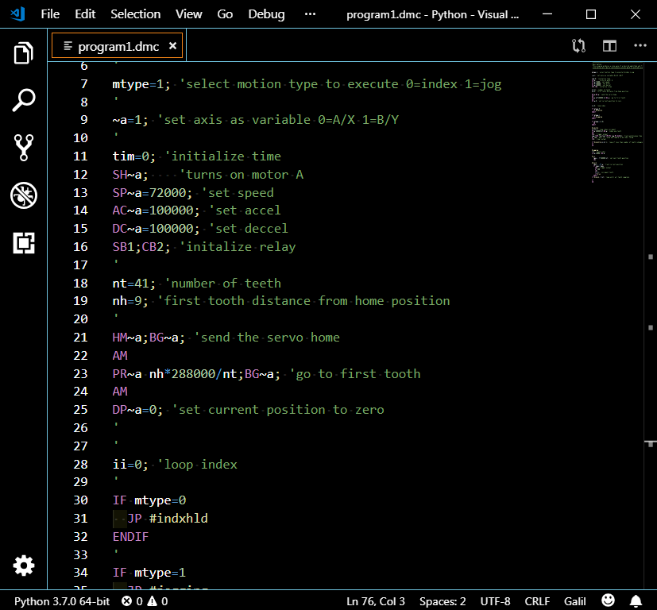

# Galil DMC Syntax
This is Galil Motion Control DMC language syntax highlighting for Microsoft Visual Studio Code. Provides syntax highlighting support for `.dmc` files. For more information on Galil Motion Control DMC syntax visit [ Galil Motion Control](http://www.galilmc.com/)

## Installation

## Known Issues

## Release Notes

### 0.0.1

* Updated README.md
* Replaced default/auto-generated syntax with DMC syntax

## [UNLICENSE](./UNLICENSE)
